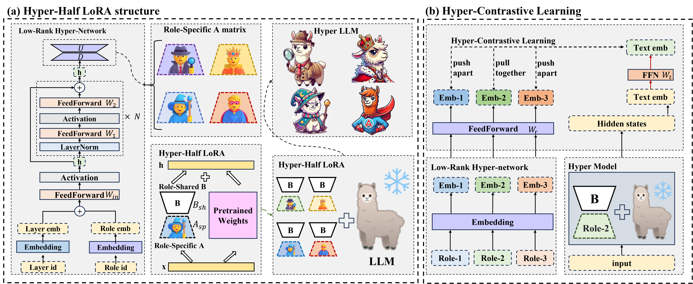

# HyCoRA: Hyper-Contrastive Role-Adaptive Learning for Role-Playing

[](https://arxiv.org/abs/2511.08017)
[](https://github.com/yshihao-ai/HyCoRA)
[]()
[]()


**Shihao Yang**<sup>1*</sup>, **Zhicong Lu**<sup>2*</sup>, **Yong Yang**<sup>1*</sup>, **Bo Lv**<sup>2</sup>, **Yang Shen**<sup>1</sup>, **Nayu Liu**<sup>1†</sup>

<sup>1</sup>Tiangong University, <sup>2</sup>University of Chinese Academy of Sciences  
<sup>*</sup>Equal Contribution, <sup>†</sup>Corresponding Author

</div>

---

## 📖 Introduction


Multi-character role-playing (MCRP) allows large language models to emulate the tones, personalities, and knowledge of diverse characters, providing immersive user experiences. However, existing methods typically adopt Low-Rank Adaptation (LoRA) in two extreme paradigms, each with limitations:

1.  **Shared Module Paradigm**: Training all characters with a single shared adapter. While this captures common features, it often fails to represent fine-grained, distinct role-specific traits due to feature interference (Figure 1a).
2.  **Independent Module Paradigm**: Assigning a separate adapter to each role. This approach suffers from data sparsity for individual roles, limits the transfer of shared linguistic knowledge, and incurs high parameter costs (Figure 1b).

To address these challenges, we propose **HyCoRA** (**Hy**per-**Co**ntrastive **R**ole-**A**daptive learning), a framework designed to balance the learning of distinct and shared traits. **Intuitively, different roles interpret questions from distinct perspectives (Role-Specific) but generate responses following shared linguistic rules (Role-Shared).**

Based on this insight, HyCoRA introduces a **Hyper-Half LoRA** structure (Figure 1c). We decouple the LoRA matrices: the role-specific **Matrix A** is dynamically generated by a lightweight hyper-network to capture unique persona signatures, while **Matrix B** remains shared to encode common knowledge. Additionally, we employ a **Hyper-Contrastive Learning** mechanism to help the hyper-network distinguish subtle personality differences by contrasting role-specific responses.

<br clear="all" />
<p align="center"><em>Figure 1: Comparison of different role-playing adaptation strategies.</em></p>

## 🚀 Methodology

To capture both unique and shared behaviors, HyCoRA introduces a **Hyper-Half LoRA** structure and a **Hyper-Contrastive Learning** mechanism.


<p align="center"><em>Figure 2: The overall framework of HyCoRA.</em></p>

### Key Components:
1.  **Hyper-Half LoRA**:
    * **Role-Specific Matrix A**: Generated dynamically by a lightweight **Hyper-network** using Character IDs and Layer IDs. This captures role-specific persona signatures.
    * **Role-Shared Matrix B**: A shared trainable matrix across all roles, designed to capture common linguistic traits and knowledge.
2.  **Hyper-Contrastive Learning (HCL)**:
    * We introduce an auxiliary contrastive loss that pulls role embeddings closer to the representations of their own responses while pushing them away from other roles. This helps the hyper-network generate more discriminative role-specific parameters.

## 🛠️ Environment Setup

We provide an automated workflow to set up the environment from scratch. 

**Prerequisites:** [Anaconda](https://www.anaconda.com/) or [Miniconda](https://docs.conda.io/en/latest/miniconda.html) installed.

```bash
# 1. Create a clean Conda environment with Python 3.9
conda create -n hycora python=3.9 -y

# 2. Activate the environment
conda activate hycora

# 3. Install PyTorch 1.13.1 with CUDA 11.7 support
conda install pytorch==1.13.1 torchvision==0.14.1 torchaudio==0.13.1 pytorch-cuda=11.7 -c pytorch -c nvidia

# 4. Install remaining dependencies from requirements.txt
pip install -r requirements.txt
```

**Core Dependencies:**

* `transformers==4.37.0`
* `peft==0.4.0`
* `bitsandbytes==0.39.0`
* `trl==0.7.11`

## 📂 Project Structure

```text
HyCoRA/
├── component/             # Core components and utilities
├── data.zip/              # Dataset path
├── eval_args/             # Configuration JSONs for evaluation
├── hyper_model/           # Model definitions (ChatGLM2, Qwen2, LLaMA, HyperNetwork)
│   ├── glm2_hypernetwork/
│   ├── qwen2_hypernetwork/
│   └── llama_hypernetwork/
├── script/
│   └── evaluate/          # Evaluation scripts
├── train_args/            # Configuration JSONs for training
├── train.py               # Main training entry point
└── requirements.txt       # Dependencies
```

## 📂 Dataset Preparation

Since the dataset is compressed to ensure efficient transfer, please unzip `data.zip` to the project root directory before running any scripts.

```bash
# Option 1: Using unzip (Linux/Mac)
unzip data.zip

# Option 2: Using Python (Windows/Universal)
# If you don't have 'unzip' installed, run this Python one-liner:
python -c "import zipfile; zipfile.ZipFile('data.zip').extractall('.')"
```

## ⚡ Quick Start

### 1. Training

To train the model (e.g., using **Qwen2-7B**), use the following command. The configuration is managed via JSON files in `train_args`.

```bash
CUDA_VISIBLE_DEVICES=0 python train.py \
    --train_args_file ./train_args/sft/hyperlora/qwen2-7b-sft-hyperlora.json
```

### 2. Evaluation

To evaluate the trained model, use the evaluation script with the corresponding configuration file:

```bash
CUDA_VISIBLE_DEVICES=0 python script/evaluate/evaluate.py \
    --eval_args_file ./eval_args/sft/hyperlora/qwen2-7b-sft-hyperlora.json
```

## 📝 Citation

If you find our work helpful, please consider citing:

```bibtex
@misc{yang2025hycorahypercontrastiveroleadaptivelearning,
      title={HyCoRA: Hyper-Contrastive Role-Adaptive Learning for Role-Playing}, 
      author={Shihao Yang and Zhicong Lu and Yong Yang and Bo Lv and Yang Shen and Nayu Liu},
      year={2025},
      eprint={2511.08017},
      archivePrefix={arXiv},
      primaryClass={cs.CL},
      url={https://arxiv.org/abs/2511.08017}, 
}
```
## Star History
[](https://star-history.com/#yshihao-ai/HyCoRA&Date)

## 🙏 Acknowledgments

We would like to express our gratitude to the following open-source projects for their inspiration and code base:

* **[RoleBench](https://github.com/InteractiveNLP-Team/RoleLLM-public)**: For the high-quality multi-character role-playing dataset and benchmark.
* **[Firefly](https://github.com/yangjianxin1/Firefly)**: For the robust large model fine-tuning framework.
* **[Hyper-Adapter (Fairseq)](https://github.com/cbaziotis/fairseq/tree/hyperadapters/examples/adapters)**: For the reference implementation of hyper-networks.


